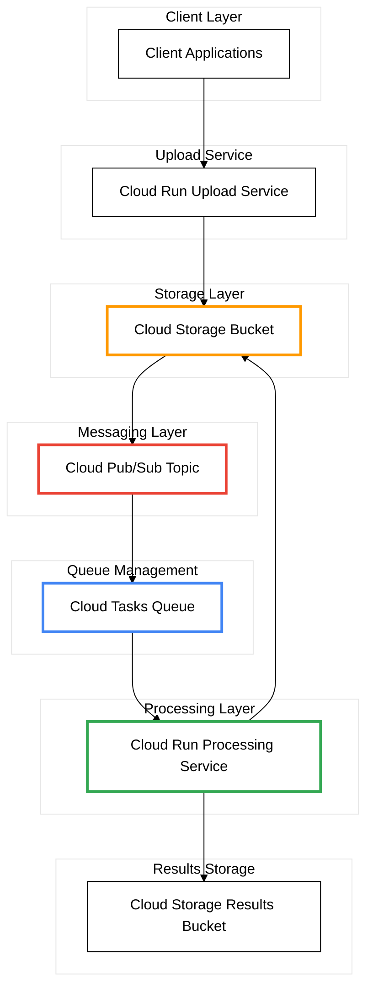

# Asynchronous File Processing System


## Overview

A scalable system for processing large file uploads asynchronously on Google Cloud Platform. Users can upload files and continue working while the system handles time-intensive processing in the background.

**Perfect for:** Video encoding, image processing, document analysis, data transformation

---

## Why This Architecture?

Traditional file upload systems make users wait during processing, leading to timeouts and poor experience. This system:

-  Accepts files instantly (non-blocking)
-  Processes in the background
-  Scales automatically with demand
-  Retries failed tasks automatically
-  No server management required

---

## Architecture



### Components

**Upload Service** - Receives files and queues processing jobs  
**Cloud Storage** - Stores uploaded and processed files  
**Cloud Tasks** - Manages background job execution with retries  
**Processing Service** - Executes file processing logic

---

## Quick Start

### Prerequisites

- Google Cloud Project with billing enabled
- gcloud CLI installed
- Docker (for containerization)

### Setup

```bash
# Set your project
export PROJECT_ID="your-project-id"
export REGION="us-central1"

# Enable required APIs
gcloud services enable run.googleapis.com cloudtasks.googleapis.com storage.googleapis.com

# Create storage buckets
gsutil mb -l ${REGION} gs://${PROJECT_ID}-uploads
gsutil mb -l ${REGION} gs://${PROJECT_ID}-results

# Create task queue
gcloud tasks queues create file-processing --location=${REGION}

# Deploy services (see deployment section)
```

### Deploy Services

```bash
# Upload Service
cd services/upload-service
gcloud run deploy upload-service \
  --source . \
  --region ${REGION} \
  --allow-unauthenticated

# Processing Service
cd ../processing-service
gcloud run deploy processing-service \
  --source . \
  --region ${REGION}
```

---

## Permissions et Privilèges (IAM)

Chaque service a son propre compte de service avec des permissions spécifiques pour suivre le principe du moindre privilège.

### Upload Service - Permissions

Le service d'upload nécessite :

```bash
# Permissions pour écrire dans le bucket uploads
gsutil iam ch serviceAccount:UPLOAD_SERVICE_ACCOUNT:roles/storage.objectCreator \
  gs://${PROJECT_ID}-uploads

# Permissions pour créer des tâches dans Cloud Tasks
gcloud tasks queues add-iam-policy-binding file-processing \
  --location=${REGION} \
  --member=serviceAccount:UPLOAD_SERVICE_ACCOUNT \
  --role=roles/cloudtasks.enqueuer
```

**Résumé :**
-  Écriture dans le bucket uploads
-  Création de tâches Cloud Tasks
-  Pas d'accès au bucket results

### Processing Service - Permissions

Le service de traitement nécessite :

```bash
# Permissions pour lire depuis le bucket uploads
gsutil iam ch serviceAccount:PROCESSING_SERVICE_ACCOUNT:roles/storage.objectViewer \
  gs://${PROJECT_ID}-uploads

# Permissions pour écrire dans le bucket results
gsutil iam ch serviceAccount:PROCESSING_SERVICE_ACCOUNT:roles/storage.objectCreator \
  gs://${PROJECT_ID}-results
```

**Résumé :**
-  Lecture depuis le bucket uploads
-  Écriture dans le bucket results
-  Pas d'accès à Cloud Tasks

### Obtenir les comptes de service

```bash
# Compte de service Upload
UPLOAD_SA=$(gcloud run services describe upload-service \
  --region=${REGION} \
  --format='value(spec.template.spec.serviceAccountName)')

# Compte de service Processing
PROCESSING_SA=$(gcloud run services describe processing-service \
  --region=${REGION} \
  --format='value(spec.template.spec.serviceAccountName)')
```

### Sécurité

- **Upload Service** : Endpoint public (à sécuriser avec API key en production)
- **Processing Service** : Endpoint privé (appelé uniquement par Cloud Tasks)
- Chaque service utilise son propre compte de service isolé

---

## Usage

Upload a file:

```bash
curl -X POST https://your-upload-service-url/upload \
  -F "file=@myfile.jpg"
```

Response:
```json
{
  "status": "accepted",
  "file_id": "abc123",
  "message": "File queued for processing"
}
```

Check results:
```bash
gsutil ls gs://${PROJECT_ID}-results/abc123/
```

---

## How It Works

1. User uploads a file → immediate response
2. File stored in Cloud Storage
3. Processing task created in queue
4. Background service processes the file
5. Results saved to results bucket

**If processing fails:** Automatic retries with Cloud Tasks

---

## Configuration

Key settings you can adjust:

- **Max file size** - Default: 100MB
- **Retry attempts** - Default: 5
- **Concurrent tasks** - Default: 100
- **Processing timeout** - Default: 5 minutes

Edit these in your service environment variables.

---

## Cost Estimate

**For 10,000 files/month:**
- Cloud Run: ~$5
- Cloud Storage: ~$2
- Cloud Tasks: $0.40
- **Total: ~$7-8/month**

---

## Monitoring

View queue status:
```bash
gcloud tasks queues describe file-processing --location=${REGION}
```

View service logs:
```bash
gcloud run logs read upload-service --region=${REGION}
```

---

## Next Steps

- Add a web UI for file uploads
- Implement real-time status notifications
- Add file type-specific processing
- Create processing analytics dashboard

